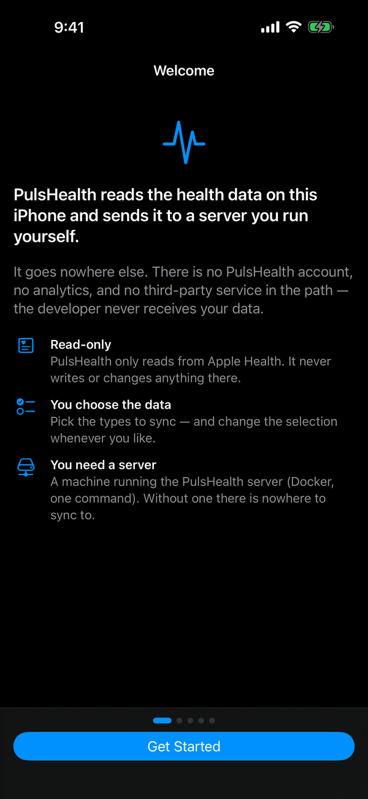
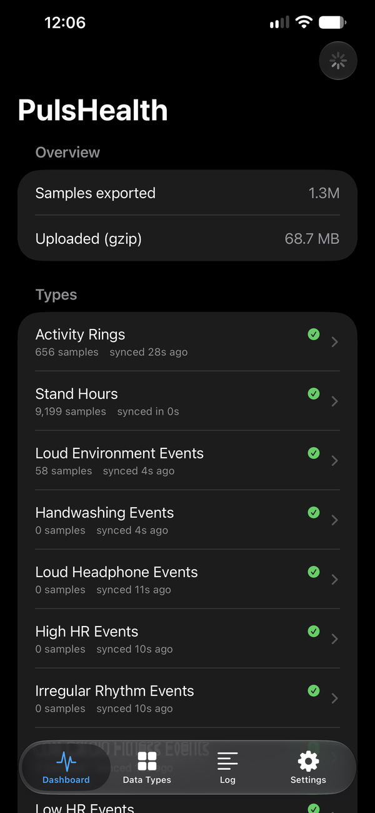
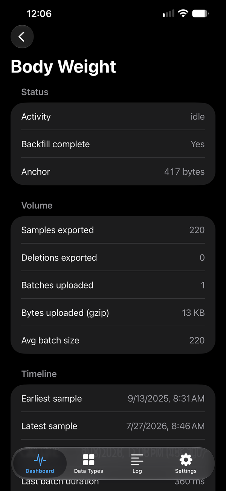
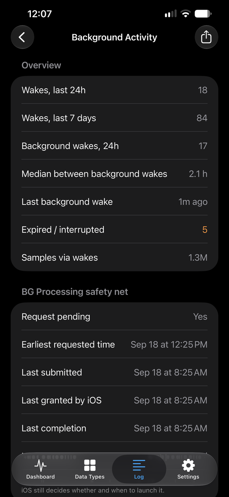

# PulsHealth

Sync Apple Health to a backend you control, then use the data with your own
tools — SQL, Grafana, notebooks, and AI assistants.

PulsHealth is an iOS app, and the Swift package underneath it, that reads
HealthKit and streams every sample — a full historical backfill first, then
continuous near-real-time updates — as gzip NDJSON to an HTTP endpoint you
configure. Nothing is sent anywhere else. This repository also ships a
reference backend for it (PostgreSQL 17 + TimescaleDB, a Go ingest server, a
read-only product API with an OpenAPI document, Grafana dashboards, a web
viewer, and an MCP server so Claude, Cursor and other AI assistants can
answer questions from your data) that runs with one `docker compose up`, and
it is where the sync protocol is written.

**[PulsHealth is on the App Store](https://apps.apple.com/us/app/pulshealth/id6757657354)** —
free, iPhone. The backend is yours to run; see [Quickstart](#quickstart).

**No server? Export to files.** The app does not need one to be useful:
**Settings → Export Data** writes the selected data straight from HealthKit to
CSV (for spreadsheets) or JSONL (the sync protocol itself — complete, and
replayable into a server later), for the last 30 days up to all time, and hands
the files to the share sheet. Nothing is uploaded. Formats and columns are in
[`docs/export.md`](docs/export.md#on-device-export-no-server).

> **The backend is pre-release.** The app ships from the store, but standing
> up the server it syncs to still expects someone comfortable with Docker, and
> this is honest about what is missing:
>
> - The wire protocol, the **Puls Sync Protocol v1**, is specified in
>   [`docs/protocol/`](docs/protocol/README.md) with JSON Schema and a
>   fixture corpus, but it is young: expect clarifications, and report gaps
>   through the "Backend implementer question" issue template.
> - **Schema migrations are automatic** (the `migrate` service applies
>   `server/db/migrations/` on every start), but an install created before
>   it existed needs a one-time `make baseline` — see `server/README.md`.
> - **Backups are opt-in and off by default.** The stack ships a `backup`
>   service, but it only runs when you enable its profile
>   (`docker compose --profile backup up -d backup`, or `make backup` for one
>   dump). Until then your Postgres volume is the only copy of your data.
>   Nothing verifies a backup except the restore drill in `server/README.md`.
>
> What is still outstanding is [`docs/roadmap.md`](docs/roadmap.md); the
> decisions, requirements and phases behind it are in
> [`docs/open-source-plan.md`](docs/open-source-plan.md).

## Components

| Component | Path | What it is |
|---|---|---|
| **iOS app** | [`PulsHealth/`](PulsHealth/README.md) | SwiftUI app over the package: type picker, backfill with live progress and ETA, per-type dashboard, event log, background-activity telemetry, settings, throughput benchmark. |
| **`PulsHealthSync`** | [`PulsHealthSync/`](PulsHealthSync/README.md) | Swift package (iOS 17+, Swift 6 strict concurrency, zero dependencies): anchored-query sync engine, on-device aggregates, activity rings, background scheduling, HTTP transport, NDJSON encoding. Embeddable in other apps. |
| **Reference server** | [`server/`](server/README.md) | Docker Compose stack: TimescaleDB, Go ingest API, Go product API (OpenAPI 3.1), Grafana with provisioned dashboards and alert rules. |
| **Web viewer** | [`web/`](web/README.md) | Next.js viewer (activity rings, trends, workouts, catalog) reading Postgres directly. |
| **Marketing site** | [`site/`](site/README.md) | Next.js static export behind pulshealth.com: product pages, the documentation rendered from this repository's Markdown (`/docs`), the blog, and the knowledge-base viewer. Distinct from `web/`. |
| **Knowledge base** | [`knowledge-base/`](knowledge-base/README.md) | 177 YAML files describing every HealthKit type — what it measures, how it is interpreted, typical and notable ranges, sources. Read by `site/` at build time; useful on its own. |
| **Blog** | [`blog/`](blog/BLOG_SYSTEM.md) | The site's MDX posts and their images, also read by `site/` at build time. |
| **Protocol** | [`docs/protocol/`](docs/protocol/README.md) | The Puls Sync Protocol v1 specification, JSON Schema, fixture corpus, a checker (`tools/protocol-check/`), and a minimal Python + SQLite receiver (`examples/receivers/python-sqlite/`). |
| **MCP server** | [`server/mcp/`](server/mcp/README.md) | Read-only MCP server over the product API for Claude Desktop, Claude Code, Cursor and remote connectors: daily metrics, rings, workouts, latest readings, with an embedded guide for the model. Setup in [`docs/ai.md`](docs/ai.md). |

<p align="center">
  
  
  
  
</p>

The iOS app: first run, the dashboard after a backfill, one type's sync
detail, and the background-activity log. Screenshots of the web viewer and
the Grafana dashboards are still to come.

For the database data model, table guide, and query patterns (including how
to avoid iPhone + Watch double counting), see
[`docs/database-guide.md`](docs/database-guide.md).

## Architecture

```
┌────────────── iPhone ──────────────┐      ┌────────── your server ──────────┐
│ HealthKit store                    │      │                                 │
│   │ HKAnchoredObjectQuery (paged)  │      │  ingest (Go) ──► PostgreSQL 17  │
│   ▼                                │ HTTPS│   bearer auth     + TimescaleDB │
│ HealthSyncEngine (actor)           │─────►│   gzip NDJSON     hypertables,  │
│   per-type anchors, TaskGroup ×4   │      │   idempotent      compression   │
│   gzip NDJSON batches              │      │        │                        │
│   HKObserverQuery + bg delivery    │      │        ▼                        │
│   BGProcessingTask catch-up        │      │  product API · Grafana · web    │
└────────────────────────────────────┘      └─────────────────────────────────┘
```

The app only ever talks to the URL you enter. Any HTTP server that accepts
the batch format can stand in for the reference stack — see
[Bring your own backend](#bring-your-own-backend).

## Quickstart

### Server

You need a Linux (or macOS) box with Docker (and its Compose plugin),
`openssl` and `curl`. Nothing else: the pairing QR code is drawn in the
terminal by `qrencode` when you have it and by the ingest container itself
when you do not.

```bash
git clone https://github.com/PulsHealth/pulshealth.git
cd pulshealth
scripts/bootstrap.sh --time-zone Europe/Berlin   # the zone your phone lives in
```

That one command creates `server/.env` with every secret generated, starts
the stack — `docker compose up -d`, which pulls the published images from
`ghcr.io/pulshealth` and runs the `migrate` service (schema) before anything
else — waits for ingest to answer, and prints a **pairing block**: the URL
the phone should use, the bearer token, the user ID, and a QR code encoding
all three. Leave `--time-zone` out and it uses the host's zone and says so;
every daily view buckets by this calendar, so it must match the phone's.
`make pairing` prints the block again whenever you need it, and
`scripts/bootstrap.sh --issue-device "My iPhone"` prints the same block for a
token of that phone's own instead of the shared one
([per-device tokens](server/README.md#tokens)).

Where the phone reaches the server is the one decision left to you. Until
you make it, the pairing block's URL reads `(none yet)` and there is no QR
code: ingest listens on `127.0.0.1` only, where no phone can reach it.
Re-run the script with one of these (it changes only that setting):

- **Same Wi-Fi, nothing else to set up:** `scripts/bootstrap.sh --lan` binds
  ingest to every interface (`INGEST_BIND_ADDR=0.0.0.0`), and the pairing
  block carries `http://<this host's LAN IP>:8080` — the app accepts plain
  `http://` for local-network addresses. That is plaintext on your LAN with
  the token as the only protection: fine on a network you control, nowhere
  else.
- **From anywhere:** put a TLS-terminating proxy or Tailscale Serve/Funnel
  in front of port 8080 (`server/README.md`, "Exposing the server") and
  hand its URL to the script: `scripts/bootstrap.sh --url
  https://health.example.net`. Ingest stays on loopback and the QR code
  carries the HTTPS URL.

Everything else binds to loopback: the product API on `8081`, the MCP server
on `8082`, Grafana on `3000`, the web viewer on `3001`, Postgres on `5432`.
Those host ports are fixed in `server/docker-compose.yml` — only the bind
addresses are settings — so they must be free: a Postgres already listening
on 5432, or a dev server on 3000, stops `docker compose up`.
Re-running `scripts/bootstrap.sh` is safe — it never regenerates secrets —
and `make up`, `make down`, `make logs`, `make ps` wrap Compose (`make help`
lists the rest). Upgrading is `git pull && make pull up`: the images come
from the registry, but the compose file and the schema migrations they
expect come from the checkout, so the two move together (`CHANGELOG.md`
says what each release needs). `server/README.md` covers "Images and
versions", configuration, schema migrations, the scoped database role for
ingest, and Grafana.

**Building from source instead** — after a change in `server/` or `web/`:
`make dev-up` (or `scripts/bootstrap.sh --build`) builds the four app images
from the checkout through the `server/compose.build.yml` overlay.

### App

Install it from the App Store —
**[PulsHealth](https://apps.apple.com/us/app/pulshealth/id6757657354)**, free.

To build it from source instead you need Xcode 26,
[XcodeGen](https://github.com/yonaskolb/XcodeGen), and — for running on a
real iPhone — a paid Apple Developer team (the HealthKit background-delivery
entitlement requires one).

```bash
brew install xcodegen
cd PulsHealth
xcodegen          # generates PulsHealth.xcodeproj; seeds Config/Local.xcconfig
open PulsHealth.xcodeproj
```

Put your Team ID in `PulsHealth/Config/Local.xcconfig` (gitignored; the
generated project is too), select your device, and run.

Either way, in the app:

1. Grant Health access when asked (the app is read-only; it never writes to
   HealthKit).
2. **Settings → Server:** scan the pairing block's QR code, paste its
   `puls://pair?…` line with **Paste Pairing Code**, or enter the server URL
   and token by hand (`make pairing` re-prints the block; the QR code encodes
   the same values). Pointing the iOS Camera app at the QR code works too: it
   offers to open PulsHealth, which asks you to confirm the server's host
   before it fills anything in. Then tap **Test Connection**.
3. **Data Types:** pick what to sync (a "Common" preset covers the usual
   types) and tap Apply. Types with no history sync from your chosen start
   date; the dashboard shows per-type progress, rate, and ETA.

Open the web viewer at `http://localhost:3001` on the server, or Grafana at
`http://localhost:3000`, and watch the data arrive.

Skipping step 2 is fine: with no server the app syncs nothing, says so on the
Dashboard, and **Settings → Export Data** still writes what you selected to
files.

Several people on one server: give each phone its own user ID under
**Settings → User** (the default is a fixed UUID so a reinstall keeps its
identity) and issue each its own token with `scripts/bootstrap.sh
--issue-device "<label>" --user <that user ID>`, which ends in a QR code that
phone scans — a device token is bound to its user, so no phone can write as
another. On the reading side `PULS_USER_ID` is the user
shown by default; set `PULS_MULTI_USER=true` in `server/.env` and the product
API answers for any user a request names (`?user=<uuid>`, listed by
`GET /v1/users`), which the MCP server and the web viewer use to let you pick
whose data you are looking at. Off, which is the default, every read is
`PULS_USER_ID`'s and naming anyone else is refused — the API's one token
reads everyone once the gate is on, so it is a deliberate switch.

## Use it with AI

The stack includes a read-only [MCP](https://modelcontextprotocol.io) server
(`server/mcp/`) so an AI assistant can answer questions from your data:
"how many steps did I average last week", "compare my runs this month to
last month", "did I close my rings yesterday". It talks only to the product
API, returns deduplicated daily values with their units, and carries a
guide for the model on the data's traps (iPhone + Watch double counting,
cumulative versus discrete metrics, the time-zone rule). Eleven tools cover
profile, the type catalogue, latest and daily metrics, activity rings,
workouts and their intra-workout series, raw samples, sleep, and state of
mind.

Local clients (Claude Desktop, Claude Code, Cursor) run the binary in stdio
mode against your API; for example, in Claude Code:

```bash
go build -o pulshealth-mcp ./server/mcp
claude mcp add pulshealth -s user \
  -e PULS_API_URL=https://<your-api-host>:8444 \
  -e PULS_API_TOKEN=<PULS_API_TOKEN from server/.env> \
  -e PULS_TIME_ZONE=Europe/Berlin \
  -- "$PWD/pulshealth-mcp"
```

Remote clients connect to the Compose `mcp` service over HTTPS with
`PULS_MCP_TOKEN`. Config snippets for every client, the remote-connector
recipe, demo prompts and the security notes are in
[`docs/ai.md`](docs/ai.md) — which also covers ChatGPT, which takes a
different route: importing the API's `/openapi.json` as a custom GPT Action,
with caveats worth reading first.

For a whole range as a *file* rather than an answer in a chat,
`GET /v1/export` streams any dataset as CSV or JSONL and `tools/puls-export`
is a small CLI for it: [`docs/export.md`](docs/export.md).

## How syncing works

- **Per-type cursors.** Each HealthKit type has its own `HKQueryAnchor`,
  persisted only *after* the server confirms the batch. A crash or failed
  upload re-sends the same page; the server deduplicates by sample UUID
  (`ON CONFLICT DO NOTHING`), so the pipeline is idempotent end-to-end.
- **Backfill** is the same anchored paging loop starting from a nil anchor,
  bounded by your chosen start date. Types run in parallel (default 4 at a
  time — HealthKit query concurrency degrades beyond that) with 1,000-sample
  pages. Fully resumable at page granularity; interrupt it freely. Workouts
  are backfilled in phases (summaries first, GPS routes and intra-workout
  series last) so one large workout cannot stall the rest.
- **Backfill order is chosen, not alphabetical.** Activity rings go first —
  one row per day, seconds of work, and the first thing a dashboard can show.
  Then a bounded recent window (30 days, or three buckets for coarser
  intervals) over any aggregate series that has never been computed: the
  server's daily views join `aggregate_series`, and only an aggregate line
  creates a row there, so until one has landed there is nothing daily to show
  however many raw samples have arrived. Then the raw sweep, which starts the
  single heaviest type (heart rate, over half of all samples for a Watch
  wearer) immediately so the long pole holds a slot from the start, and runs
  everything else cheapest-first so the tail of once-a-day types lands in the
  opening minutes. The full aggregate pass and workout enrichment follow.
  Batches therefore arrive out of chronological order — the
  [protocol](docs/protocol/README.md) requires receivers to cope with that.
- **Incremental sync** merges one page per changed type into shared uploads,
  never splitting a page across batches, so anchor-after-ack still holds
  when many types change at once.
- **Real-time** is one multi-type `HKObserverQuery` plus
  `enableBackgroundDelivery(.immediate)`. When HealthKit wakes the app it
  drains changes — including **deletions**, which anchored queries report as
  tombstones and the server applies as `DELETE`s.
- **On-device aggregates** (optional, per type): `HKStatisticsCollectionQuery`
  buckets — sums, averages, minima, maxima — by hour, day, week, or month and
  optionally per device (Watch vs. iPhone). These have no UUIDs, so the
  server upserts them, and each run recomputes a trailing window so late
  Watch data corrects itself.
- **Activity rings** (`HKActivitySummary`) sync as one upserted row per day,
  refreshed on every sync run and at most hourly off observer wakes.
- **Safety nets:** a `BGProcessingTask` runs periodic catch-up syncs when the
  device is idle, and every foreground open triggers a full incremental pass —
  the most reliable trigger iOS offers. On iOS 26 a user-initiated backfill
  runs as a `BGContinuedProcessingTask`, so it keeps going with system
  progress UI after you leave the app.
- **Reconciliation:** HealthKit may purge deletion tombstones before a sync
  sees them. Each type's detail screen can compare per-UTC-month UUID digests
  with the server (`GET /v1/digest`), re-upload anything missing, and delete
  server-side orphans.
- **Locked devices:** HealthKit is unreadable while the phone is locked.
  Background wakes that find it locked are recorded as *skipped* rather than
  pretending to sync, and the next unlock or app open catches up.

### Wire format

`POST /v1/batches` with `Authorization: Bearer <token>`, `Content-Encoding:
gzip`, and an `X-User-ID` header naming the user. The body is NDJSON (about
10× smaller gzipped): line 1 is a batch header (`batchID`, `deviceID`,
`type`, `reason`, per-kind counts); then one line per sample (UUID, type,
start/end as epoch milliseconds, value in a canonical unit, source, device,
metadata); then one line per deletion; then, as declared by the header
counts, workout-route lines (GPS points, chunked at 4,000 per line),
workout-series lines (intra-workout heart-rate, pace, and similar curves),
aggregate-bucket lines, activity-summary lines, and an optional profile line
(name, email, date of birth, sex — null clears).

Sample kinds cover quantity, category, and workout samples plus heartbeat
series (beat-to-beat offsets), ECGs (classification + microvolt trace),
State of Mind logs (iOS 18), sleep apnea events (iOS 18), workout effort
scores (iOS 18, attached to workouts), and medication dose events (iOS 26).
Every quantity is converted to one canonical unit per type before it leaves
the phone; all timestamps are epoch milliseconds.

The contract the app relies on: any **2xx** acknowledges the batch and
advances the anchor; **4xx** is never retried (anchors stay put, so nothing
is lost, but that type stalls until the server accepts it); **5xx**, **429**,
and network errors are retried with exponential backoff (2, 4, 8, 16 s,
jittered; one retry when running inside a background observer wake) under a
60 s request timeout. Retried batches are no-ops server-side. The normative
description is the [Puls Sync Protocol v1](docs/protocol/README.md); the
reference server's limits and a runnable `curl` example are in the API
section of [`server/README.md`](server/README.md).

### Bring your own backend

The app posts to a URL; the reference stack is one receiver, not the only
one. A receiver needs to accept the batch, deduplicate samples by UUID,
upsert aggregate buckets and activity summaries by their identity, and return
2xx. Everything it must do is in the **Puls Sync Protocol v1** under
[`docs/protocol/`](docs/protocol/README.md): the transport and retry
contract, every line type with a JSON Schema, the canonical units, the
idempotency rules, a minimal-receiver checklist, and a fixture corpus with
the counts a reference server returns.

- [`examples/receivers/python-sqlite/`](examples/receivers/python-sqlite/README.md)
  is a complete receiver in one standard-library Python file writing to
  SQLite — copy it, or read it alongside the spec. Its `smoke_test.py` posts
  the whole corpus to **any** receiver URL and checks the responses.
- [`tools/protocol-check/`](tools/protocol-check/) validates captured
  batches against the schemas and the framing rules.
- The optional read endpoints (`/v1/capabilities`, `/v1/stats`, `/v1/digest`,
  `/v1/uuids`) back the app's connection test, server-count, and
  reconciliation screens and can be left out; the app probes a receiver
  without `/v1/capabilities` with an empty batch.

Gaps in the spec go in the "Backend implementer question" issue template;
those answers become spec text.

## Performance expectations

Measure your actual device with **Settings → Diagnostics → Run Throughput
Benchmark** (reads real HealthKit data through a discarding transport; does
not touch sync state). Planning numbers:

**Initial backfill** (foreground, plugged in, LAN or VPN to the server):

| Profile | Volume | Expected duration |
|---|---|---|
| Casual iPhone-only user, 5 years | ~1–2 M samples | **2–6 min** |
| Apple Watch wearer, 3 years | ~5–10 M samples (heart rate at ~3.5 K/day dominates) | **15–40 min** |
| Heavy Watch user (daily workouts), 5+ years, all types | ~15–25 M samples | **45–90 min** |

Device-side HealthKit reads are the bottleneck (~3–10 K samples/s per type on
recent iPhones, XPC-deserialization-bound); the server ingests 50–100 K
rows/s, so it never queues. The dashboard shows live per-type rate and ETA.
Backfills pause if iOS suspends the app and resume on next open — progress is
never lost.

**Event → queryable-in-database latency** (steady state):

| Data path | Typical latency | Why |
|---|---|---|
| Written on iPhone, immediate-class type (workouts, body mass, HRV, …) | **seconds** (≈1–10 s) | `.immediate` background delivery is honoured |
| Steps / active energy / distance (iPhone) | **up to ~1 h** | iOS silently limits background delivery for these types to about hourly |
| Anything recorded on Apple Watch | **minutes–hours** | Watch → iPhone HealthKit sync is opportunistic and Apple provides no API to force it. Opening the app (or charging the Watch) usually triggers it |
| Device locked | deferred | The Health database is encrypted ~10 min after lock; the next unlock or wake catches up |
| App force-quit by the user | until the next app open | iOS stops waking force-quit apps |
| Activity rings | next sync run, at most hourly off observer wakes | Activity summaries are not observable and have no background delivery; the current day is re-queried on every run and upserted |

Upload plus ingest adds under a second on a LAN. The per-type **Sample →
upload latency** stat on the type detail screen shows the number you are
actually getting.

## FAQ

**My Watch data arrives minutes or hours late.**
Watch → iPhone HealthKit transfer is scheduled by watchOS and cannot be
forced by any app. Opening PulsHealth, or putting the Watch on its charger,
usually prompts it. Once the data is on the phone it syncs normally.

**Steps, active energy, and distance lag by up to an hour, while workouts
appear in seconds.**
iOS throttles "immediate" background delivery for those high-frequency types
to roughly hourly, without saying so. It is not configurable. Anything else
you record on the phone, and every foreground open, syncs right away.

**Nothing synced overnight.**
While the phone is locked, HealthKit is unreadable (every query fails with
`errorDatabaseInaccessible`), and iOS prefers to run background processing
when the device is idle — which is to say locked, overnight. PulsHealth
detects this, records the wake as *skipped (locked)* on the Background
Activity screen instead of claiming a sync, and catches up at the next unlock
or app open.

**I swiped the app away and it stopped syncing.**
iOS does not wake force-quit apps for background delivery or scheduled
tasks. Open the app again and it resumes; leaving it in the app switcher is
enough.

**Blood pressure never shows up in the permission sheet.**
On iOS 26.5 the Health permission sheet silently omits blood pressure
systolic/diastolic, so they can never be granted from within the app (Apple
Feedback FB22735935). Grant them yourself in **Settings → Privacy &
Security → Health → PulsHealth**; the app shows a hint when it detects the
situation and backfills the full history once access exists.

**Daily step totals in the database are higher than the Health app shows.**
The iPhone and the Watch both record steps, and a naive sum of raw samples
counts both. Use the `metric_daily` view (or the app's on-device aggregate
series, which HealthKit already de-duplicates) instead of summing
`quantity_samples`. `docs/database-guide.md` explains the query patterns.

**Can I sync to something other than the reference stack?**
Yes — see [Bring your own backend](#bring-your-own-backend).

**Does it write anything into Apple Health?**
No. The app requests read access only, and its usage strings say so.

## Observability

- **App → Dashboard:** per-type anchor presence, backfill state,
  samples/deletions/batches/bytes exported, earliest/latest sample dates,
  last sync time and duration, live rate and ETA, last error.
- **App → Log:** filterable live event stream (persisted across launches and
  mirrored to `os.Logger` — `log stream --predicate 'subsystem ==
  "com.pulsHealth.healthsync"'` from a Mac). **Log → Background Activity** keeps one
  durable record per wake (trigger, duration, outcome, work done, Low Power
  Mode, thermal state) and exports them for analysis.
- **Instruments:** signposts (`syncAll`, `syncType`) profile every phase.
- **Server:** structured JSON logs per batch (counts, bytes, parse/insert
  timings); a PulsHealth dashboard for the health data and an Ops dashboard
  for ingest health (batches/hour, rows/day, per-type totals, last-batch age)
  with provisioned alert rules; `GET /v1/stats` returns per-type row counts
  to cross-check against the app.

## Security notes

- **Your data goes only to your server.** There is no PulsHealth service, no
  analytics, no crash reporting. The app makes requests to the URL you
  configure and nowhere else.
- **An export is a file you hand over yourself.** Export Data makes no network
  request: it stages files in the app's temporary directory (never backed up),
  gives them to the iOS share sheet, and deletes its copy once the share
  completes, when another export starts, and at every launch. The files are
  not encrypted and carry no token — see [`SECURITY.md`](SECURITY.md).
- **Bearer tokens.** The ingest server accepts a shared static `PULS_TOKEN`
  — whoever holds it can upload and delete data for any user ID — and
  per-device tokens (`make devices ARGS='issue --user <uuid> --name <label>'`)
  that are hashed at rest, bound to one user, revocable one at a time and
  show when they were last used. The shared token stays on by default; set
  `PULS_ALLOW_SHARED_TOKEN=false` once every phone has its own and it stops
  authenticating. On the phone the token is
  kept in the Keychain (`kSecAttrAccessibleAfterFirstUnlockThisDeviceOnly`, so
  background wakes can still reach it and a backup cannot carry it to another
  device), never in the sync-state file. Guessing it is slow, at least: ingest
  rate-limits **failed** authentications per client IP (10 per minute, `429`
  with `Retry-After` after that) and never throttles a request that presents
  the right token — `server/README.md`, "Rate limiting".
- **Put the ingest endpoint behind TLS.** Every service binds to loopback by
  default; expose only the ingest port, and only through a TLS-terminating
  proxy or a VPN. The one exception is `scripts/bootstrap.sh --lan`
  (`INGEST_BIND_ADDR=0.0.0.0`): plain HTTP for a phone on the same Wi-Fi,
  with the token as the only protection — for a network you control, never
  a shared one. Never publish the product API, Grafana, or Postgres on a
  public interface.
- **The MCP server's tokens are read access to everything the product API
  serves.** Its Compose service binds to loopback like the API; publish it
  only over HTTPS, and keep the client config files that hold the token out
  of version control. `docs/ai.md` has the details.
- **The web viewer's login is optional.** Set `WEB_AUTH_PASSWORD` and every
  page asks for it over HTTP Basic (any username; `/api/healthz` stays open
  for health checks); `scripts/bootstrap.sh` generates one on a fresh install
  and prints it. Leave it empty and the viewer is a read-only page over your
  health database with no login at all. Either way the bind address still
  matters — Basic auth sends the password on every request — so keep
  `WEB_BIND_ADDR` on loopback or a private network, never `0.0.0.0`.
- **The database holds identifiable data** (name, email, date of birth, sex
  next to the samples). Ingest connects as the scoped DML-only `ingest`
  role, never as the superuser (`server/README.md`, "The scoped `ingest`
  role").
- **Backups exist but are off** until you enable the `backup` profile
  (`server/README.md`, "Backup & restore"). Turn them on, point
  `PULS_BACKUP_DIR` at a disk that is not this one, take a `make backup`
  before any schema change, and run the restore drill once — nothing else
  verifies that your dumps are restorable.

Found a vulnerability? Report it privately — see [`SECURITY.md`](SECURITY.md).

## What this is not

- **Not a hosted service.** Nobody runs a PulsHealth server for you, and
  that is deliberate.
- **Not on Android.** The v1 type vocabulary is HealthKit's. The protocol is
  platform-neutral in shape, so a Health Connect client is possible later,
  but none is planned here.
- **Not a writer.** It never modifies HealthKit data.
- **Not a sink for every cloud.** The app speaks HTTP to one URL; S3, Google
  Sheets, Notion, and similar are a receiver's job, not the app's.

## Development

```bash
# Swift package tests (Swift Testing)
cd PulsHealthSync && xcodebuild test -scheme PulsHealthSync \
  -destination 'platform=iOS Simulator,name=iPhone 17'

# App (regenerate the project after adding or removing files)
cd PulsHealth && xcodegen && xcodebuild build -scheme PulsHealth \
  -destination 'platform=iOS Simulator,name=iPhone 17'

# App-hosted tests (need the HealthKit entitlement; run the aggregate
# function × type matrix probe on every new iOS runtime)
cd PulsHealth && xcodebuild test -scheme PulsHealth \
  -destination 'platform=iOS Simulator,name=iPhone 17'

# Server unit tests (no database needed)
cd server/ingest && go vet ./... && go test ./...
cd ../api      && go vet ./... && go test ./...
cd ../mcp      && go vet ./... && go test ./...

# Web viewer
cd web && npm ci && npm run lint && npm run typecheck && npm test && npm run build

# Marketing site (bun; exports 211 static pages to site/out: 177 from
# knowledge-base/, read as a repository-root sibling, and eleven under /docs/
# rendered from the READMEs, docs/ guides, SECURITY.md and CHANGELOG.md)
cd site && bun install && bun run lint && bun run build

# The whole stack from this checkout (server/compose.build.yml overlay)
make dev-up
```

Integration tests, the Compose validation, and the rules that keep the app
and server in step are in [`CONTRIBUTING.md`](CONTRIBUTING.md). `CLAUDE.md`
lists the invariants (anchor-after-ack, canonical units, epoch-ms
everywhere, upsert vs. never-overwrite) and the HealthKit gotchas; it is
written for AI coding agents and is worth reading regardless.
[`AGENTS.md`](AGENTS.md) is the shorter orientation for an automated
contributor — components, where the authoritative facts live, and the test
command for every suite — and [`llms.txt`](llms.txt) indexes the
documentation for a model reading the repository cold.

### Tuning

Settings exposes batch size (250–5,000) and type concurrency (1–8). The
defaults (1,000 × 4) are field-tested; use the benchmark to validate on your
device and network. Larger batches help on high-latency links; smaller ones
reduce memory and re-upload cost after failures.

## Contributing, security, license

- [`CONTRIBUTING.md`](CONTRIBUTING.md) — DCO sign-off, per-component setup,
  what to run before a pull request. Issue templates cover bugs, feature
  requests, and questions from people implementing their own receiver.
- [`SECURITY.md`](SECURITY.md) — private vulnerability reporting and scope.
- [`docs/privacy-policy.md`](docs/privacy-policy.md) — what the app reads,
  where it sends it (only your server), and what stays on the phone.
  [`docs/appstore/`](docs/appstore/README.md) holds the App Store listing copy,
  review notes, and the recipe for the throwaway review backend.
- [`CODE_OF_CONDUCT.md`](CODE_OF_CONDUCT.md) — Contributor Covenant.
- [`LICENSE`](LICENSE) — Apache License 2.0, for everything in this
  repository. [`NOTICE`](NOTICE) carries the attribution.
- [`TRADEMARK.md`](TRADEMARK.md) — the PulsHealth name, icon, and App Store
  listing are reserved; forks ship under their own name and bundle
  identifier; "works with PulsHealth" and "implements the Puls Sync
  Protocol" are welcome.
