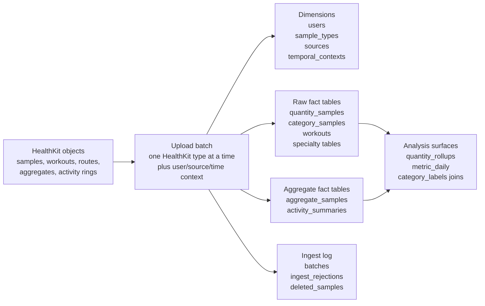

# PulsHealth Data And Schema Guide

This document explains what data the PulsHealth database stores, how the schema
is shaped, and how to query it without misreading the health data. It is written
for someone who wants to understand the database as a data model, not operate
the Docker stack.

The short version: PulsHealth turns HealthKit objects into a personal health
warehouse in PostgreSQL/TimescaleDB. Raw HealthKit events are preserved in
sample tables, HealthKit-computed aggregates are stored separately, and derived
views provide safer analysis surfaces for common daily metrics.

## Mental Model

HealthKit data arrives as batches from the iOS app. Each batch contains one or
more HealthKit objects plus metadata about the device wake that produced the
upload. The ingest server normalizes shared dimensions, writes raw facts, and
records batch-level observability.



There are five kinds of data:

| Kind | What it means | Main tables |
|---|---|---|
| Dimensions | Shared labels and identity used by facts | `users`, `sample_types`, `sources`, `temporal_contexts`, `category_labels` |
| Raw samples | Individual HealthKit observations with UUIDs | `quantity_samples`, `category_samples`, `workouts`, `heartbeat_series`, `ecg_samples`, `state_of_mind`, `medication_dose_events` |
| Workout series | Points that belong to a workout | `workout_route_points`, `workout_series_points` |
| Aggregates | HealthKit-computed buckets and daily summaries | `aggregate_series`, `aggregate_samples`, `activity_summaries` |
| Operations | Sync history, rejected uploads, deletion tombstones, ingest timing | `batches`, `ingest_rejections`, `deleted_samples` |

## Schema Map

The public schema is centered on `users`, `sample_types`, and time-series fact
tables. Most rows belong to a user. Most HealthKit data rows point to
`sample_types` so you can filter by HealthKit identifier instead of local
numeric IDs.

```mermaid
erDiagram
  users ||--o{ quantity_samples : owns
  users ||--o{ category_samples : owns
  users ||--o{ workouts : owns
  users ||--o{ heartbeat_series : owns
  users ||--o{ ecg_samples : owns
  users ||--o{ state_of_mind : owns
  users ||--o{ medication_dose_events : owns
  users ||--o{ aggregate_samples : owns
  users ||--o{ activity_summaries : owns
  users ||--o{ batches : uploaded

  sample_types ||--o{ quantity_samples : classifies
  sample_types ||--o{ category_samples : classifies
  sample_types ||--o{ aggregate_series : defines
  sample_types ||--o{ workout_series_points : classifies

  sources ||--o{ quantity_samples : source
  sources ||--o{ category_samples : source
  sources ||--o{ workouts : source
  sources ||--o{ heartbeat_series : source
  sources ||--o{ ecg_samples : source
  sources ||--o{ state_of_mind : source
  sources ||--o{ medication_dose_events : source

  workouts ||--o{ workout_route_points : route
  workouts ||--o{ workout_series_points : series

  aggregate_series ||--o{ aggregate_samples : buckets
  category_labels ||--o{ category_samples : decodes

  temporal_contexts ||--o{ quantity_samples : local_time
  temporal_contexts ||--o{ category_samples : local_time
  temporal_contexts ||--o{ workouts : local_time
  temporal_contexts ||--o{ workout_route_points : local_time
  temporal_contexts ||--o{ workout_series_points : local_time
  temporal_contexts ||--o{ aggregate_samples : local_time
  temporal_contexts ||--o{ activity_summaries : local_day
```



## Core Concepts

### User

Every data row carries a `user_id`. The database currently seeds one default
user, but the schema is multi-user capable. For analysis, always include
`user_id` when comparing counts or building persistent summaries.

Table: `users`

Grain: one row per person.

Primary key: `id`.

Important columns:

| Column | Meaning |
|---|---|
| `id` | UUID used as the foreign key on data tables |
| `name`, `email` | Optional profile identity from the app |
| `dob`, `biological_sex` | Profile attributes used by derived metrics such as heart-rate zones |

### HealthKit Type

HealthKit identifiers such as `HKQuantityTypeIdentifierStepCount` are stored in
`sample_types`. Numeric `type_id` values are local database IDs. They are not
stable across databases.

Table: `sample_types`

Grain: one row per HealthKit identifier seen by ingest.

Primary key: `type_id`.

Natural key: `identifier`.

Important columns:

| Column | Meaning |
|---|---|
| `identifier` | Full HealthKit identifier string |
| `kind` | Broad kind such as `quantity`, `category`, or `workout` |
| `unit` | Canonical unit used by the app for quantity samples |

Rule: join through `sample_types.identifier`; do not hardcode `type_id`.

### Source

Sources describe where a HealthKit object came from, for example Apple Watch,
iPhone, or another app.

Table: `sources`

Grain: one unique `(name, bundle_id, version)` tuple.

Primary key: `source_id`.

Use this table when you need to separate Watch and iPhone data or understand
overlapping sources.

### Time

Event times are stored as `timestamptz` UTC instants. Some rows also carry
temporal-context IDs so the original local wall time can be reconstructed.

Table: `temporal_contexts`

Grain: one unique `(time_zone_id, utc_offset_seconds, source, confidence,
tzdb_version)` combination.

Important columns:

| Column | Meaning |
|---|---|
| `time_zone_id` | IANA zone such as `Europe/Berlin` |
| `utc_offset_seconds` | Offset at the event instant |
| `source` | How the context was obtained |
| `confidence` | How trustworthy the context is |

Use UTC timestamps for ordering. Use temporal context only when local wall-clock
meaning matters, such as sleep nights or local-day reconstruction.

### UUIDs And Idempotency

Most raw HealthKit objects have UUIDs. Retried uploads are expected, so raw
sample tables use UUID-based keys and ignore duplicates. Aggregate tables are
different: they are recomputed buckets, so they upsert by bucket identity.

## Table Families

### 1. Raw Quantity Samples

Table: `quantity_samples`

What it stores: numeric HealthKit samples: heart rate, body mass, steps, active
energy, HRV, distance, VO2 max, respiratory rate, and other
`HKQuantityTypeIdentifier*` data.

Grain: one row per HealthKit quantity sample, per user.

Primary key: `(uuid, start_ts)`.

TimescaleDB: hypertable on `start_ts`, one-month chunks, old chunks compressed
with columnstore.

Important columns:

| Column | Meaning |
|---|---|
| `uuid` | HealthKit object UUID |
| `type_id` | FK to `sample_types` |
| `start_ts`, `end_ts` | Sample interval |
| `value` | Numeric value in the app's canonical unit |
| `source_id` | FK to `sources` |
| `metadata` | HealthKit metadata as JSON |
| `user_id` | FK to `users` |
| `start_temporal_context_id`, `end_temporal_context_id` | Optional local-time reconstruction context |

Use this table when you need raw samples, latest readings, high-resolution
series, source-specific analysis, or debug-level inspection.

Example:

```sql
SELECT q.start_ts, q.end_ts, q.value, st.unit, s.name AS source
FROM quantity_samples q
JOIN sample_types st ON st.type_id = q.type_id
LEFT JOIN sources s ON s.source_id = q.source_id
WHERE st.identifier = 'HKQuantityTypeIdentifierHeartRate'
ORDER BY q.start_ts DESC
LIMIT 25;
```

Gotcha: cumulative metrics such as steps can overlap across sources. For daily
truth, prefer `metric_daily` or HealthKit aggregate tables over naively summing
raw samples across all sources.

### 2. Raw Category Samples

Table: `category_samples`

What it stores: enum-like HealthKit intervals and events: sleep analysis,
symptoms, mindful sessions, stand hours, menstrual flow, and other
`HKCategoryTypeIdentifier*` data.

Grain: one row per HealthKit category sample, per user.

Primary key: `uuid`.

Important columns:

| Column | Meaning |
|---|---|
| `uuid` | HealthKit object UUID |
| `type_id` | FK to `sample_types` |
| `start_ts`, `end_ts` | Event or interval time |
| `value` | Integer enum value from HealthKit |
| `source_id` | FK to `sources` |
| `metadata` | HealthKit metadata as JSON |
| `user_id` | FK to `users` |

Join to `category_labels` to decode `value`.

```sql
SELECT c.start_ts, c.end_ts, c.value, cl.label, cl.enum_name
FROM category_samples c
JOIN sample_types st ON st.type_id = c.type_id
LEFT JOIN category_labels cl
  ON cl.type_identifier = st.identifier
 AND cl.value = c.value
WHERE st.identifier = 'HKCategoryTypeIdentifierSleepAnalysis'
ORDER BY c.start_ts DESC
LIMIT 50;
```

Gotcha: a raw integer category value is not meaningful without its HealthKit
type. The same integer can mean different things for different category types.

### 3. Workouts

Table: `workouts`

What it stores: one HealthKit workout session with summary fields and rich JSON
details.

Grain: one row per workout UUID, per user.

Primary key: `uuid`.

Important columns:

| Column | Meaning |
|---|---|
| `activity_type` | HealthKit workout activity type |
| `start_ts`, `end_ts` | Workout interval |
| `duration_s` | Duration in seconds |
| `energy_kcal`, `distance_m` | Common workout totals |
| `stats` | Legacy/basic statistics JSON |
| `stats_detail` | Per-type min/avg/max/sum details |
| `events` | Workout events such as pauses or laps |
| `activities` | Multi-sport sub-activities |
| `source_id`, `metadata`, `user_id` | Shared dimensions |

Related tables:

| Table | Relationship |
|---|---|
| `workout_route_points` | GPS points keyed by `workout_uuid` |
| `workout_series_points` | Intra-workout quantity curves keyed by `workout_uuid` and `type_id` |

Example:

```sql
SELECT start_ts, end_ts, activity_type, duration_s, energy_kcal, distance_m,
       stats_detail
FROM workouts
ORDER BY start_ts DESC
LIMIT 20;
```

### 4. Workout Route Points

Table: `workout_route_points`

What it stores: GPS route points from `HKWorkoutRoute`.

Grain: one point per workout timestamp.

Primary key: `(workout_uuid, ts)`.

TimescaleDB: hypertable on `ts`.

Important columns:

| Column | Meaning |
|---|---|
| `workout_uuid` | Workout this point belongs to |
| `ts` | Point timestamp |
| `lat`, `lon` | Coordinates |
| `altitude_m`, `h_acc_m`, `v_acc_m`, `speed_mps`, `course_deg` | Optional GPS attributes |
| `user_id` | FK to `users` |

Use with `workouts` to draw routes or inspect route quality.

### 5. Workout Series Points

Table: `workout_series_points`

What it stores: intra-workout quantity streams such as heart rate, cycling
power, speed, or cadence.

Grain: one point per `(workout_uuid, type_id, ts)`.

Primary key: `(workout_uuid, type_id, ts)`.

TimescaleDB: hypertable on `ts`, compressed by workout for older chunks.

Use this table when the question is about what happened inside a workout, not
just the workout summary.

### 6. Specialty HealthKit Objects

These tables store HealthKit objects that are neither simple quantity samples
nor category samples.

| Table | Grain | What it stores |
|---|---|---|
| `heartbeat_series` | One row per heartbeat-series sample | Beat-to-beat offsets stored as JSON |
| `ecg_samples` | One row per ECG | Classification, average HR, sampling rate, symptoms status, voltage trace |
| `state_of_mind` | One row per state-of-mind entry | Momentary emotion or daily mood, valence, labels, associations |
| `medication_dose_events` | One row per medication dose event | Medication name, status, scheduled time, dose quantity and unit |

These tables follow the same general pattern: HealthKit UUID, start/end time,
optional source, metadata, user, and optional temporal context.

### 7. HealthKit Aggregate Series

Tables: `aggregate_series`, `aggregate_samples`

What they store: values computed on device by HealthKit statistics queries.
These are not raw samples. They are bucketed summaries such as daily step sum,
hourly heart-rate average, or weekly active-energy sum.

`aggregate_series` grain: one aggregate definition.

Natural key:

```text
(type_id, agg_func, interval_value, interval_unit, device_filter)
```

Important `aggregate_series` columns:

| Column | Meaning |
|---|---|
| `type_id` | HealthKit metric being aggregated |
| `agg_func` | `sum`, `average`, `min`, `max`, `mostRecent`, or `duration` |
| `interval_value`, `interval_unit` | Bucket size, such as `1 day` |
| `device_filter` | `all`, `watch`, or `iphone` |
| `unit` | Unit for bucket values |

`aggregate_samples` grain: one value for one aggregate series, bucket start,
and user.

Primary key: `(series_id, bucket_start, user_id)`.

Important `aggregate_samples` columns:

| Column | Meaning |
|---|---|
| `series_id` | FK to `aggregate_series` |
| `bucket_start`, `bucket_end` | Aggregate bucket interval |
| `value` | Bucket value; nullable when the bucket is explicitly empty |
| `user_id` | FK to `users` |
| `updated_at` | Last server update time |

Aggregates upsert. If HealthKit recomputes a bucket, the new upload overwrites
the old value.

Use aggregates when you want HealthKit's own source-deduped view of cumulative
metrics.

### 8. Activity Summaries

Table: `activity_summaries`

What it stores: daily `HKActivitySummary` rings: Move, Exercise, Stand, goals,
and move mode.

Grain: one local calendar day per user.

Primary key: `(user_id, date)`.

Important columns:

| Column | Meaning |
|---|---|
| `date` | Local activity-ring date, not a UTC timestamp |
| `move_kcal`, `move_goal_kcal` | Active-energy ring value and goal |
| `exercise_min`, `exercise_goal_min` | Exercise ring value and goal |
| `stand_hours`, `stand_goal_hours` | Stand ring value and goal |
| `move_mode` | Active-energy mode or Apple Move Time mode |
| `move_time_min`, `move_time_goal_min` | Move Time fields for that mode |

Activity summaries are mutable during the current day, so ingest upserts them.
Do not reconstruct rings from raw quantity samples unless this table is missing.

### 9. Category Labels

Table: `category_labels`

What it stores: a lookup from `(type_identifier, value)` to a readable label and
HealthKit enum name.

Grain: one enum value per category type.

Primary key: `(type_identifier, value)`.

Use this table whenever you query `category_samples.value`.

### 10. Quantity Rollups

View: `quantity_rollups`

What it stores: Timescale continuous aggregate over `quantity_samples`.

Grain: one hour per `(type_id, source_id, user_id)`.

Columns:

| Column | Meaning |
|---|---|
| `bucket` | One-hour bucket |
| `sum_value`, `avg_value`, `min_value`, `max_value` | Hourly stats |
| `n` | Number of raw samples in the bucket |

Use this for broad exploration across long time ranges. For cumulative metrics,
remember it is grouped by source so consumers can avoid double-counting
overlapping Watch and iPhone samples. Real-time aggregation is enabled, so reads
also combine the materialized history with raw rows from the current,
not-yet-materialized hour.

### 11. Metric Daily

View: `metric_daily`

What it stores: one daily value per metric and user. This is the best general
surface for daily analytics.

Grain: one row per `(identifier, user_id, day)`.

Columns:

| Column | Meaning |
|---|---|
| `identifier` | HealthKit identifier |
| `type_id` | Local sample type ID |
| `user_id` | User |
| `day` | Local day in `puls_time_zone()`, i.e. the stack's `PULS_TIME_ZONE` (UTC when unset) |
| `value` | Daily value |
| `source` | `aggregate` if from HealthKit aggregate buckets, otherwise `rollup` |

Resolution order:

1. Prefer only the canonical HealthKit series: `sum` for an explicitly
   cumulative type or `average` for an explicitly discrete type, with
   `interval_value = 1`, `interval_unit = 'day'`, and `device_filter = 'all'`.
   HealthKit handles cross-source deduplication for that series. Other
   functions, intervals, and device-specific series never compete for the
   daily value.
2. Fall back to `quantity_rollups` when no canonical daily bucket exists.
   Cumulative types use the highest single-source daily sum to avoid overlap;
   discrete types use a sample-count-weighted cross-source average.

Only types with a configured `sum` or `average` series are included. That
explicitly establishes cumulative versus discrete semantics; a type configured
only with `min`, `max`, `mostRecent`, or `duration` is omitted rather than
assigned a plausible but incorrect daily value.

Example:

```sql
SELECT day, value, source
FROM metric_daily
WHERE identifier = 'HKQuantityTypeIdentifierStepCount'
ORDER BY day DESC
LIMIT 30;
```

### 12. Batches

Table: `batches`

What it stores: one row per upload batch received by the ingest server. This is
operational data, but it is essential for understanding whether the health data
is current.

Grain: one row per batch UUID.

Primary key: `batch_id`.

Important columns:

| Column | Meaning |
|---|---|
| `device_id` | Sending device identifier from the app |
| `type_identifier` | HealthKit type carried by the batch |
| `reason` | Why the client produced the batch |
| `sample_count`, `deletion_count`, `aggregate_count`, `activity_summary_count` | Payload counts |
| `bytes` | Compressed upload size |
| `exported_at` | Client export time |
| `received_at` | Server receipt time |
| `wake_id`, `trigger` | iOS wake correlation fields |
| `parse_ms`, `insert_ms` | Server timing |

Use this table first when debugging data freshness.

### 13. Ingest Rejections

Table: `ingest_rejections`

What it stores: metadata for authenticated batch requests that failed before a
successful row could be committed to `batches`. It deliberately stores no
HealthKit request-body data.

Important columns:

| Column | Meaning |
|---|---|
| `received_at` | Server time of the failed request |
| `batch_id`, `wake_id`, `trigger` | Client correlation headers, when present |
| `status` | HTTP response status |
| `stage` | Failure phase: `gzip`, `encoding`, `parse`, `identity`, `wake`, or `insert` |
| `error_message` | Bounded diagnostic message |
| `bytes` | Compressed bytes read before failure |

Use this with `batches` when deciding whether apparent silence means no wake or
failed uploads.

### 14. Deleted Samples

Table: `deleted_samples`

What it stores: HealthKit deletion tombstones reported by anchored queries.

Grain: one deletion UUID per user.

Important columns:

| Column | Meaning |
|---|---|
| `uuid` | Deleted HealthKit object UUID |
| `type_identifier` | HealthKit type of the deleted object |
| `deleted_at` | Server time when the tombstone was recorded |

The server also applies deletes to the raw tables when deletion information
arrives.

## Query Patterns

### List Metrics Present In The Database

```sql
SELECT identifier, kind, unit
FROM sample_types
ORDER BY identifier;
```

### Latest Value For A Quantity Type

```sql
SELECT q.start_ts, q.value, st.unit, src.name AS source_name
FROM quantity_samples q
JOIN sample_types st ON st.type_id = q.type_id
LEFT JOIN sources src ON src.source_id = q.source_id
WHERE st.identifier = 'HKQuantityTypeIdentifierBodyMass'
ORDER BY q.start_ts DESC
LIMIT 10;
```

### Daily Metric Trend

```sql
SELECT day, value, source
FROM metric_daily
WHERE identifier = 'HKQuantityTypeIdentifierStepCount'
ORDER BY day;
```

### Sleep By Stage

```sql
SELECT c.start_ts,
       c.end_ts,
       extract(epoch FROM c.end_ts - c.start_ts) / 3600.0 AS hours,
       cl.label AS stage
FROM category_samples c
JOIN sample_types st ON st.type_id = c.type_id
LEFT JOIN category_labels cl
  ON cl.type_identifier = st.identifier
 AND cl.value = c.value
WHERE st.identifier = 'HKCategoryTypeIdentifierSleepAnalysis'
ORDER BY c.start_ts DESC;
```

### Recent Workouts With Routes

```sql
SELECT w.uuid,
       w.start_ts,
       w.activity_type,
       w.duration_s,
       w.distance_m,
       count(r.*) AS route_points
FROM workouts w
LEFT JOIN workout_route_points r ON r.workout_uuid = w.uuid
GROUP BY w.uuid
ORDER BY w.start_ts DESC
LIMIT 20;
```

### Ingest Freshness

```sql
SELECT type_identifier,
       max(received_at) AS last_received_at,
       sum(sample_count) AS samples_received
FROM batches
GROUP BY type_identifier
ORDER BY last_received_at DESC NULLS LAST;
```

### One Row Per Device Wake

```sql
SELECT min(received_at) AS wake_started_at,
       trigger,
       count(*) AS batches,
       sum(sample_count) AS samples,
       sum(bytes) AS bytes,
       max(parse_ms) AS max_parse_ms,
       max(insert_ms) AS max_insert_ms
FROM batches
WHERE wake_id IS NOT NULL
GROUP BY wake_id, trigger
ORDER BY wake_started_at DESC;
```

## Which Table Should I Use?

| Question | Use |
|---|---|
| What was my daily step count? | `metric_daily` |
| What is the latest body weight sample? | `quantity_samples` joined to `sample_types` |
| What sleep stages were recorded last night? | `category_samples` joined to `category_labels` |
| What workouts happened recently? | `workouts` |
| What was my route for a workout? | `workout_route_points` joined to `workouts` |
| What was heart rate during a workout? | `workout_series_points` joined to `sample_types` |
| What does HealthKit say the daily aggregate was? | `aggregate_samples` joined through `aggregate_series` |
| What are today's Activity rings? | `activity_summaries` |
| Did the phone upload recently? | `batches` |
| Why are category values numeric? | Decode with `category_labels` |

## Important Gotchas

- Do not hardcode `type_id`. Always filter on `sample_types.identifier`.
- Raw cumulative samples can double-count across sources. Prefer
  `metric_daily` or `aggregate_samples` for daily cumulative truth.
- `activity_summaries.date` is a local calendar date, not a UTC instant.
- Server-side day boundaries (`metric_daily` and every other daily view or
  query bucketed on the server) follow `puls_time_zone()`, which returns the
  stack's `PULS_TIME_ZONE` setting (UTC when unset). It must match the phone's
  zone, or server-computed days disagree with the on-device daily aggregates
  and activity rings.
- Raw samples are immutable facts; aggregate buckets and activity summaries are
  recomputed and upserted.
- `quantity_samples` and workout point tables are Timescale hypertables. Old
  chunks may be compressed.
- Category integer values only make sense with both `type_identifier` and
  `category_labels`.
- `batches.received_at` is server time; sample `start_ts` and `end_ts` are
  HealthKit event times.
- Deletion tombstones are best-effort HealthKit data. If HealthKit purges a
  tombstone before sync sees it, reconciliation is needed.

## Appendix: Minimal Connection Notes

Admin access on the Docker host running the stack, from the `server/`
directory (or wherever the compose file lives):

```bash
docker compose exec db psql -U postgres -d postgres
```

Read-only access from another machine. Postgres is not meant to be reachable
beyond the host, so open an SSH tunnel and connect through it as the read-only
`grafana` role:

```bash
ssh -N -L 15432:127.0.0.1:5432 <user>@<host>
PGPASSWORD='<database-password>' psql -h 127.0.0.1 -p 15432 -U grafana -d postgres
```

Any GUI client (TablePlus, DBeaver, pgAdmin, DataGrip, ...) works the same way:
SSH tunnel to `<host>`, then host `127.0.0.1`, port `15432`, user `grafana`,
database `postgres`. The passwords live in the stack's ignored `.env`
(`POSTGRES_PASSWORD`, `GRAFANA_DB_PASSWORD`), never in this guide.

Local disposable database:

```bash
cd server
cp .env.example .env
docker compose up -d db
```

Fresh installs apply `server/db/init/*.sql` only on an empty database volume.
Existing live databases require manual schema application.
